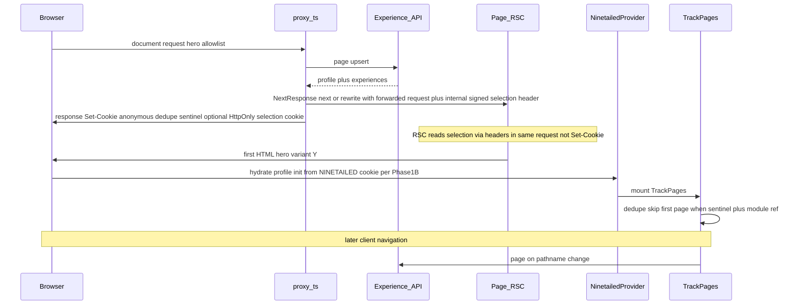

# Contentful Personalization (frontend) implementation plan

This plan follows the [Quick start guide](https://contentful.com/developers/docs/personalization/quick-start-guide/), [Experience SDK](https://www.contentful.com/developers/docs/personalization/experience-sdk/), [Edge and Server Side Rendering](https://www.contentful.com/developers/docs/personalization/edge-and-server-side-rendering/), and the [Preview plugin](https://www.contentful.com/developers/docs/personalization/preview-plugin/) documentation. **Stack:** **Ninetailed Experience SDK** (`@ninetailed/experience.js-*`).

## Key decisions (vs earlier drafts)

**This POC** is **[locked](#locked-phase-0-decisions-approved-for-this-project--poc)** (hero, hybrid, browser-only, Privacy without `identify`, no Custom Flags). **Selection handoff:** **`Set-Cookie` on the outgoing response is not visible to the same request’s RSC `cookies()` read** — forward selection on the **request** via **`NextResponse.next` / `rewrite` with `{ request: { headers } }`** (Phase 3.3); optionally add **`HttpOnly` selection cookie** for follow-up `cookies()` reads. **Do not conflate** with **`NINETAILED_ANONYMOUS_ID_COOKIE`**. **`proxy.ts`:** guards + **hero route allowlist**. **Phase 1 merge gates:** profile-init literal API, Privacy `component` typing, preview bundle graphs (see Phase 1 intro).

## SDK choice: Experience SDK vs Optimization SDK Suite

**This POC:** Ninetailed **Experience SDK** only. Optimization SDK remains an alternative for future work.

## Locked Phase 0 decisions (approved for this project — POC)

| Area | Decision |
| --- | --- |
| **Scope** | **POC — not production policy template.** Pre-consent `component` accepted for this **non-public** POC. **Do not** copy into **customer-facing / EU production** templates without DPO/legal + allowlist revisit. |
| **First scenario** | **Hero by audience**. |
| **Rendering / ESR** | **Hybrid** — [`src/proxy.ts`](file:///Users/charliechrisman/Code/tjx-contentful-marketing-starter-template/src/proxy.ts) + **TrackPages**; guarded `proxy` + route allowlist (Phase 3). |
| **SDK** | **Experience SDK** only. |
| **Identity** | **No `identify()`** in code (primary). Post allowlist **`['page', 'track', 'component']`** omits `identify` (belt-and-braces). |
| **Privacy `allowedEvents`** | **Pre:** `['page', 'component']`. **Post:** `['page', 'track', 'component']`. **Verify:** `EventType` (or equivalent) in pinned **`@ninetailed/experience.js-plugin-privacy`** includes `'component'` + Network shows impressions not dropped. |
| **Custom Flags** | **Out of scope.** |
| **`environment` prop** | Must **exactly match** the Personalization install UI string (not only `main` / `development`; aliases possible). |

## Phase 0 — Execution checklist

1. Hero by audience.  
2. Hybrid: Phase 1.D + Phase 3. **`proxy`** classifies requests; **`TrackPages`** handles browser route keys.  
3. Experience SDK.  
4. No `identify()`.  
5. Privacy + consent switch.  
6. CMS + `environment`.  
7. Smoke: `experience.ninetailed.co`.

## Prerequisites

- License, Client ID, hero model, test Audience + Experience.

## Phase 1 — Client shell, TrackPages, Insights, Privacy, Preview, metrics

**Phase 1 merge gates (all required before Phase 1 is “done” in PR review)**

1. **Profile init (1.B):** the **literal** `NinetailedProvider` prop/callback for the **pinned** `@ninetailed/experience.js-next` version is wired and documented — no “TODO verify `onInitProfileId`.”  
2. **Privacy `component`:** `EventType` (or equivalent) on the pinned **`@ninetailed/experience.js-plugin-privacy`** package includes **`'component'`**; smoke Network shows impressions not dropped (locked table + Verification).  
3. **Preview bundle (Phase 4):** bundle analysis shows the preview plugin chunk **absent or unreachable** on production build graphs (see Phase 4 **when / how**).

**A. Pin `@ninetailed/*`** — one compatible major; lockfile recorded.

**B. `'use client'` `NinetailedAppProviders`**

- Never mount `NinetailedProvider` inside RSC-only files.  
- **`environment`**, **`locale`** (SDK = profile label locale only): per locked table / Phase 0.  
- **Profile continuity:** after pinning, read `@ninetailed/experience.js-next` types and wire the **literal** supported API (**`onInitProfileId`** vs **callback** vs renamed prop) so the client reads **`NINETAILED_ANONYMOUS_ID_COOKIE`** correctly. **Confirm the shared SDK’s cookie options / defaults** before overriding `HttpOnly` / `Secure` / `SameSite` on that cookie — do not hand-set attributes in a way that **breaks SDK expectations**.  
- **Plugins:** Insights, Privacy (verbatim lists), Preview when draft/preview (Phase 4).  
- Import from [`src/app/[locale]/layout.tsx`](file:///Users/charliechrisman/Code/tjx-contentful-marketing-starter-template/src/app/[locale]/layout.tsx).

**C. Missing Ninetailed env**

- Full app shell; omit provider only; baseline branches before SDK-only imports.

**D. TrackPages × `proxy` — dedupe (decoupled from selection transport)**

- **`nt_initial_page_handled` (or prefixed name):** set by **`proxy` only when it actually performed** the initial Experience **`page`** for a classified hero request. **`Secure` on all HTTPS** (production, preview, staging); omit **`Secure`** only on **local HTTP** dev. `SameSite=Lax`; short `Max-Age`; **non-HttpOnly** if the client reads it for the skip handshake.  
- **`TrackPages`:** skip **exactly one** client `page()` for the **initial** route key when the sentinel is present + **module-scoped ref** (Phase 0 narrative) to survive Strict Mode / cookie timing; **always** `page()` on real route-key changes. **Do not** overload this protocol with selection-encoding concerns — selection uses **header / optional HttpOnly cookie** (Phase 3).  
- **`NINETAILED_ANONYMOUS_ID_COOKIE`:** use the **constant** from `@ninetailed/experience.js-shared` only; **confirm SDK defaults** before overriding cookie attributes (see Phase 1.B).

**E. `track()` + Metrics — ownership**

- **Engineering:** emit **`track('eventName')`** post-consent with the **exact** string agreed with stakeholders.  
- **Metric registration** is a **[Personalization / Optimization web app workflow](https://www.contentful.com/help/personalization/metrics/)** — typically **SE / marketer / content ops**, not engineering. The same `eventName` **must** exist as a **Metric** in the UI before **Experience Insights** attributes conversions.  
- **Latency:** treat **≥ 4h** after first test `track` as the POC validation window; internal **~2h** stories are anecdotal. *(Proxy Experience API timeout lives in **Phase 3.0** only.)*

## Phase 2 — GraphQL, `Experience`, no flags / no `identify`

- Hero GraphQL, `ExperienceMapper`, JSON props, client **`Experience`** re-export, `forwardRef`.

## Phase 3 — Hybrid `proxy.ts` (checklist)

**0. Defensive API** — On failure, timeout (**POC budget ≤ 500ms** for the Experience API call in `proxy`), or bad payload: **no 5xx**, **no** selection/header/cookie side effects for personalization, **baseline hero**; existing preview/locale behavior unchanged. **Production:** retarget timeout from **observed P95/P99** of the Experience API (may be **tighter or looser** than the POC cap — 500ms edge budget is already aggressive; do not assume “always lower”).

1. **Imports** from `@ninetailed/experience.js-shared` (cookie constants, `buildPageEvent`, API client, etc.).

2. **Request guards** — Skip personalization for **requests that should not create a profile event** (prefetch, `_next` static, etc.); use matcher + headers per Next [`proxy`](https://nextjs.org/docs/app/getting-started/proxy) docs — wording is intent-based, not tied to a single Next version label.

2.5 **Hero route allowlist** — Run hero upsert / `page` / selection header / **optional** selection cookie / dedupe sentinel only on **explicit routes** that render the personalized hero (e.g. home + selected marketing landings). **Passthrough** elsewhere (`/careers`, blog without hero, etc.): **no** Experience API call, **no** extra cookies — avoids wasted calls and polluted profiles.

3. **Selection transport — split two mechanisms (do not conflate)**  
   - **Same-request RSC (concrete Next pattern):** Forward the signed selection on the **incoming request** to the app by returning **`NextResponse.next({ request: { headers: requestHeaders } })`** or **`NextResponse.rewrite(url, { request: { headers: requestHeaders } })`** with `requestHeaders` = original headers **plus** the internal selection header — that is what **`headers()`** reads in RSC for **this** request. **Do not** set only a **response** header and expect RSC to see it. Reference: [NextResponse](https://nextjs.org/docs/app/api-reference/functions/next-response).  
   - **Optional continuity:** additionally set a **short-lived `HttpOnly` signed selection cookie** for **later** `cookies()` reads if useful — **not** a substitute for same-request forwarded **request** headers.  
   - **Anonymous profile cookie (`NINETAILED_ANONYMOUS_ID_COOKIE`):** separate concern — follow **shared SDK contract** (typically **not** `HttpOnly`) so the **browser SDK** can read it for **profile init** / Phase 1.B. **Confirm SDK cookie defaults** before overriding attributes. **Never** make the anonymous cookie `HttpOnly` if the client must read it.

4. **When upsert succeeds** — Set **`NINETAILED_ANONYMOUS_ID_COOKIE`**, set **`nt_initial_page_handled`** **only if** `page` was actually sent (Phase 1.D).

5. **RSC → hero** — Decode **header** (and cookie on follow-up if used); first HTML shows variant **Y** for audience **X** (Verification).

6. **`loadingComponent`** — ESR client re-rendering path.

7. **Client profile init** — Phase 1.B literal API + anonymous cookie.

8. **Geo** — `countryCode` when present.

9. **Merge** [`src/proxy.ts`](file:///Users/charliechrisman/Code/tjx-contentful-marketing-starter-template/src/proxy.ts) preview + locale behavior.

## Phase 4 — [Preview plugin](https://www.contentful.com/developers/docs/personalization/preview-plugin/), QA, bundling

Install **`@ninetailed/experience.js-plugin-preview`**, **`NinetailedPreviewPlugin`** with mapped **`experiences`** + **`audiences`** (published + draft where needed). **Conditionally instantiate** only when Draft Mode / preview env matches ([docs](https://www.contentful.com/developers/docs/personalization/preview-plugin/)). Use **`next/dynamic`** + env gating **as in the official sample**. **When / how to verify:** add **`@next/bundle-analyzer`**, run **`ANALYZE=true npm run build`**, confirm the preview plugin chunk is **absent or unreachable** on production graphs for the default prod env. **Gate:** run the same check on **CI for PRs that touch** preview-plugin imports or provider wiring — not a one-time manual step only.

## Verification checklist

**Hero (required)**

- First HTML contains hero **variant Y** for test **Audience X** before hydration.

**Behavior**

- **`page()`** dedupe on cold load; **`page()`** on client route changes.  
- **Stickiness:** hard refresh, navigate away and back, and **browser restart** with the **same anonymous cookie** still → **same variant** for the same Audience match (within normal traffic split). **Clear all site cookies** → new anonymous profile → variant may change per experiment rules — expected.  
- Missing-env baseline.

**Debug**

- **`window.ninetailed.debug(true)`** — engineering use.  
- **`window.ninetailed.profile`** — inspect **if present**; not a hard pass/fail.

**Privacy / Insights**

- `EventType` + Network for `'component'`.

**Metrics (success / failure)**

- **Schedule** validation **≥ 4h** after first test `track`.  
- **Success:** Registered Metric in Personalization UI shows **count > 0** for controlled test traffic; per-Experience Insights shows **attribution** to the test Audience/Experience.  
- **Failure:** Counts **0** after 4h → escalate (config, Metric name mismatch, Privacy dropping events) **before** assuming SDK bug.

**Build (single convention for this repo)**

- **`npm run build && npm run start`** (matches `package.json` scripts: `next build` / `next start`).

---

## Latest review — feedback evaluation (this pass)

| Reviewer | Theme | Evaluation | Plan action |
| --- | --- | --- | --- |
| 1 | Mermaid: header not to Browser | **Correct** | Split `Proxy->>RSC` vs `Proxy->>Browser` |
| 1 | SDK cookie overrides | **Valid** | Phase 1.B + 1.D + Phase 3.3 caveat |
| 1 | Phase 3.2 wording | **Polish** | “Requests that should not create a profile event” |
| 1 | Timeout in Phase 1.E | **Valid** | Moved to Phase 3.0 only |
| 2 | `NextResponse.next({ request: { headers } })` | **Valid** | Phase 3.3 concrete API |
| 2 | Stickiness undefined | **Valid** | Verification bullets |
| 2 | Bundle analysis when/how + CI | **Valid** | Phase 4 `ANALYZE=true` + PR gate |
| 2 | Production timeout “lower” misleading | **Valid** | Phase 3.0 P95/P99 wording |
| 2 | Three merge gates | **Valid** | Phase 1 intro block |

---

## Appendix — Design-review synthesis (historical)

| Theme | Plan change |
| --- | --- |
| Selection + RSC | Header same-request; optional HttpOnly cookie |
| Two cookies | Anonymous SDK vs selection HttpOnly |
| Hero scope | Route allowlist in proxy |
