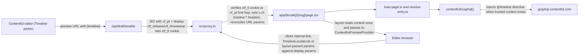

# Contentful Timeline preview support

## Goals

- Editors can click "Preview" on any Timeline release in the Contentful web app and see this Next.js site at that release.
- Timeline context applies **site-wide** (header, footer, global settings, page body, all marketing blocks).
- Implementation follows Contentful's [Timeline Preview Guide](https://www.contentful.com/help/timeline-preview-guide/) for the GraphQL `@timeline` directive (your space already exposes `TimelineFilterInput` per [src/lib/contentful/generated/types.ts](src/lib/contentful/generated/types.ts) line 8860).
- **Zero behavior change for non-preview traffic.** `@timeline` only fires when `preview === true` *and* a verified timeline context exists.
- **Trust model is signed/cookie-based**, not URL-based — see "Trust model" below.

## Trust model

The previous draft of this plan let the proxy trust raw `ctf_release` / `ctf_timestamp` URL params after shape validation. That allows a draft-mode user to tamper URL params and preview a release they were never granted by the entry point.

**New rule:** the only route that may *mint* timeline trust is `/api/draft/enable` (signs values into `cf_pt` + persists them in a signed `ctf_tl` HttpOnly cookie). `/api/draft/timeline/clear` and `/api/draft/disable` may only clear it. Everywhere else, the **signed `ctf_tl` cookie is the source of truth** after activation; the signed `cf_pt` payload may be used only as first-hop bootstrap trust for the immediate rewritten preview request.

Timeline enters through Contentful's `{timeline}` token on `/api/draft/enable`. After activation, `ctf_release` / `ctf_timestamp` are **app-owned display affordances** — they're useful so editors and stakeholders can see "I'm previewing release X" in the URL and so the Contentful iframe can pattern-match. The signed `ctf_tl` cookie is authoritative; URL params are never trusted, are reconciled against the cookie by the proxy on GET HTML page navigations, and are silently stripped from those navigations when no cookie is present.

| Surface | Reads URL params? | Reads `ctf_tl` cookie? | Writes `ctf_tl` cookie? |
|---|---|---|---|
| `/api/draft/enable` | yes (validates) | no | yes (mints signed cookie) |
| `/api/draft/timeline/clear` | no | no | clears only |
| `/api/draft/disable` | no | clears | clears |
| `src/proxy.ts` | only to compare against cookie | yes (authoritative) + signed `cf_pt` first-hop fallback | no |
| `contentfulGraphql()` | no | via `getTimelineContext()` (trusted proxy headers first, then signed cookie fallback for route handlers) | no |
| Layout/page React tree | no | via `getTimelineContext()` → context prop | no |

Sharing implication (and a doc point): a teammate cannot reuse a "post-redirect" URL because they won't have the cookie. The supported shareable URL is the original `/api/draft/enable?…&timeline=…` link — same as today's draft entry point.

## Defaults committed (override before code if you disagree)

- **Signed cookie authority** — `ctf_tl`, HttpOnly, `Secure`, **`SameSite=None`**, path `/`. `SameSite=None; Secure` is required because the preview runs inside the Contentful web app iframe (`app.contentful.com` / `app.eu.contentful.com`); `SameSite=Lax` would *not* be sent on cross-site iframe subresource requests, breaking timeline preview entirely. Mirror whatever Next's `draftMode()` cookie (`__prerender_bypass`) is configured for in this repo, since both must reach the same iframe context.
- **Cookie lifetime** — default `ctf_tl` to the existing `cf_pt` first-hop horizon (currently 15 min, re-minted on each `/api/draft/enable` visit). `cf_pt` is not the Draft Mode session lifetime; if `ctf_tl` expires while Draft Mode remains enabled, the app falls back to current draft preview and strips stale timeline display params on the next reconcilable navigation. If editor sessions feel too short, the choice during implementation is: (a) extend `ctf_tl` only and document the divergence, (b) extend both `ctf_tl` and `cf_pt` together, or (c) keep 15 min and document the re-entry requirement in the README. Default **(c)** unless we discover real friction.
- **Cookies are minted/cleared in route handlers, not the proxy.** The current [src/proxy.ts](src/proxy.ts) only `rewrite` / `redirect` / `next` — it never writes cookies, and Next 16's proxy convention's ability to attach `Set-Cookie` to a `NextResponse.next()` for the *response* is version- and runtime-dependent. Default plan: all `ctf_tl` writes happen in `/api/draft/enable`, `/api/draft/disable`, and `/api/draft/timeline/clear`. Proxy only **reads/verifies** the cookie and reconciles URL params. If during implementation we find the proxy can reliably write cookies, we may move expired-cookie cleanup there as a polish; not in the v1 scope.
- **URL params are app-owned display only** — `ctf_release`, `ctf_timestamp`; proxy rewrites or strips them on GET HTML page navigations based on the cookie (see "Trust model" above).
- **Runtime AST injection** of `@timeline` in `contentfulGraphql()` — no edits to any of the 24 `.graphql` files, codegen unchanged.
- **Live updates default to OFF** when a timeline context is active (inspector overlays remain on).
- **Site-wide propagation via React context** — no async link components; no `'use client'` on [locale-link.tsx](src/components/marketing/locale-link.tsx) (thin `TimelineLocaleLink` wrappers + layout props instead).
- **Custom preview platform URL** in Contentful: `…/api/draft/enable?secret=…&slug={entry.fields.slug}&locale={entry.fields.locale}&timeline={timeline}`.

### Local development notes

- `SameSite=None; Secure` cookies are **not sent over plain HTTP** (Chromium enforces this strictly; Firefox/Safari similar). Three options for working on Timeline locally:
  - (a) Run `next dev --experimental-https` (or equivalent) so `localhost` is served over HTTPS.
  - (b) Use a tunnel that terminates HTTPS (Cloudflare Tunnel, ngrok, Vercel preview deploy) and add the tunnel origin to `targetOrigin` in the Live Preview provider for the duration.
  - (c) Accept that embedded-iframe Timeline previews can only be exercised end-to-end on HTTPS environments; do day-to-day work over `localhost` with the cookie set manually for a top-level (non-iframe) preview.
- Add this to the README's Timeline section so future contributors aren't blocked by silent cookie drops.

## Architecture



## Files to add

- [src/lib/contentful/timeline.ts](src/lib/contentful/timeline.ts) — single source of truth.
  - Constants: `TIMELINE_RELEASE_PARAM`, `TIMELINE_TIMESTAMP_PARAM`, `TIMELINE_RELEASE_HEADER`, `TIMELINE_TIMESTAMP_HEADER`, `TIMELINE_COOKIE = 'ctf_tl'`.
  - `TIMELINE_COOKIE_OPTIONS` — exported constant `{ httpOnly: true, secure: true, sameSite: 'none', path: '/' }`. **Used identically for both set and delete** (see "Cookie deletion" note below).
  - `parseTimelineToken(token: string | null)` — wraps `parseTimelinePreviewToken` from `@contentful/timeline-preview`; returns `{}` for empty/null and maps the package's `{ releaseId, timestamp }` shape to the app's `{ release, timestamp }` context.
  - `validateRelease(s)` — `^[a-zA-Z0-9_-]{1,64}$`.
  - `validateTimestamp(s)` — strict ISO/RFC3339 DateTime acceptance. Do **not** require `new Date(s).toISOString() === s`: Contentful examples and the helper package can preserve timestamps without milliseconds (for example `2025-11-29T08:46:15Z`). Either accept valid DateTime strings as-is or normalize to `new Date(s).toISOString()` before signing/querying; keep the chosen behavior documented in this helper.
  - `signTimelineCookie(payload, secret)` / `verifyTimelineCookie(value, secret)` — HMAC envelope mirroring `preview-token.ts`, payload `{ release?: string; timestamp?: string; exp: number }` (release-only, timestamp-only, and both are all valid).
  - `getTimelineContext(): Promise<{ release?: string; timestamp?: string } | null>` — server util; first reads trusted `x-cf-timeline-*` headers (set by proxy after cookie or `cf_pt` verification), then falls back to verifying the signed `ctf_tl` cookie directly. The cookie fallback is required for route handlers such as `/api/contentful/page-link`, where proxy URL reconciliation is intentionally skipped but GraphQL still needs the active Timeline context. Returns `null` if neither source contains at least one valid value.
  - **Cookie deletion helper** — `deleteTimelineCookie(res)` that calls `res.cookies.set(TIMELINE_COOKIE, '', { ...TIMELINE_COOKIE_OPTIONS, maxAge: 0 })`. **Do not** use the bare `res.cookies.delete(TIMELINE_COOKIE)` — in some Next 16 runtimes it omits `SameSite=None; Secure` from the deletion `Set-Cookie`, which means browsers reject the deletion (cookie attributes don't match) and the cookie silently survives. Centralizing through this helper avoids the bug across all three routes (`/api/draft/enable` clear path, `/api/draft/disable`, `/api/draft/timeline/clear`).
- [src/components/contentful/timeline-context.tsx](src/components/contentful/timeline-context.tsx) — `TimelineContextProvider`, `useTimelineContext()` (client). Holds `{ release?: string; timestamp?: string } | null`.
- [src/components/contentful/timeline-locale-link.tsx](src/components/contentful/timeline-locale-link.tsx) — `'use client'` thin wrappers `TimelineLocaleLink` / `TimelineLocalePageLink` that read context and delegate to base [locale-link.tsx](src/components/marketing/locale-link.tsx) (keeps the base file free of `'use client'`).

## Files to edit

### 1. GraphQL request — inject `@timeline` directive (with guards)

[src/lib/contentful/graphql-request.ts](src/lib/contentful/graphql-request.ts)

> **Known Contentful shape.** The current space schema exposes `@timeline` as a `QUERY` directive with required `where: TimelineFilterInput!`; `TimelineFilterInput` has exactly `release_lte?: String` and `timestamp_lte?: DateTime`. The `@contentful/timeline-preview` package currently returns raw token parts as `{ releaseId?: string; timestamp?: string }`; it does not normalize timestamp formatting. Capture these constraints in a short comment block at the top of [src/lib/contentful/timeline.ts](src/lib/contentful/timeline.ts).

- Add `injectTimelineDirective(document, ctx)`:
  - Constructs the directive via `graphql`'s AST node objects (no string templating).
  - Argument shape is `@timeline(where: { release_lte?: String, timestamp_lte?: DateTime })`. Omit either key entirely when its value is absent.
  - **Idempotent**: skip if the operation already has a `@timeline` directive (returns the original document untouched).
  - **Single-operation guard**: if `document.definitions` contains more than one `OperationDefinitionNode`, throw a clear error (this codebase has one per file, but be defensive). Fragments and `ExecutableDefinitionNode` non-operations are ignored.
  - Returns a new `DocumentNode`; never mutates the input (so cached compiled documents stay clean).
- In `contentfulGraphql()`:
  - **Only when `opts.preview === true`** call `await getTimelineContext()`. On `preview: false`, the function is never invoked.
  - If context is non-null and has at least `release` or `timestamp`, inject the directive before `compactGraphqlQuery(print(document))`.
  - Keep `cache: 'no-store'` for preview (timeline contexts must never share cache).
- Expected printed query behavior: bare queries are unchanged; release-only, timestamp-only, and release+timestamp contexts add the matching `where` keys; a document that already has `@timeline` is left unchanged; `preview: false` never emits the directive.

### 2. Preview-token envelope — add release/timestamp

[src/lib/contentful/preview-token.ts](src/lib/contentful/preview-token.ts)

- Extend `PreviewTokenPayload` with `release?: string; timestamp?: string`. `verifyPreviewToken` accepts both as optional strings (backward compatible — older tokens without these fields keep working).
- The same HMAC pattern is reused by the new `signTimelineCookie` / `verifyTimelineCookie` in `timeline.ts` (re-export the underlying primitive to share code).
- `cf_pt` remains a short-lived first-hop bootstrap token. It can carry release/timestamp so the immediate proxy rewrite can set trusted timeline headers even before the browser has reliably sent `ctf_tl`; long-lived authority remains the signed `ctf_tl` cookie.

### 3. Preview activation route — accept timeline + mint cookie

[src/app/api/draft/enable/route.ts](src/app/api/draft/enable/route.ts)

- Accept either a single `timeline` query string (the `{timeline}` token from Contentful) **or** explicit `release` + `timestamp` params.
- Validate `locale` with `isLocale()` and fall back to `defaultLocale` before constructing any redirect path.
- Timeline minting requires the real `CONTENTFUL_PREVIEW_SECRET` match (`secretOk`). The existing `CONTENTFUL_POC_PREVIEW_TOGGLE=1` path may still enable current draft preview for demos, but it must **not** accept `timeline`, `release`, `releaseId`, or `timestamp` as authority and must not mint `ctf_tl`.
- Use `parseTimelinePreviewToken` from `@contentful/timeline-preview` to split the combined token. The package returns `{ releaseId?: string; timestamp?: string }`; both halves are optional. For explicit params, accept `release` or `releaseId` as aliases and normalize to the app's `release` field.
- Validate using `validateRelease` / `validateTimestamp`. Drop invalid values silently (do **not** 400 — Contentful editor expects a redirect).
- Treat `timeline=current` (or empty `timeline=`) as an **explicit clear** — keep draft mode enabled, drop the `ctf_tl` cookie via `deleteTimelineCookie(res)`, redirect to the locale/slug without timeline params. This lets editors switch back to "Current" without exiting preview entirely.
- When at least one valid value exists:
  - Bake them into the `cf_pt` payload (signed first-hop trust).
  - Set the `ctf_tl` HttpOnly signed cookie using `TIMELINE_COOKIE_OPTIONS`.
  - Append `ctf_release` / `ctf_timestamp` to the redirect URL as **display only** so the Contentful iframe sees the URL it expects.
- When no timeline values are present and `timeline` was not passed at all, leave any prior `ctf_tl` cookie alone (caller may just be re-entering preview for the same page).

```ts
// Inside the redirect response — uses shared TIMELINE_COOKIE_OPTIONS
if (releaseId || timestamp) {
  res.cookies.set(
    TIMELINE_COOKIE,
    signTimelineCookie(
      { release: releaseId, timestamp, exp: Date.now() + 15 * 60 * 1000 },
      secret,
    ),
    { ...TIMELINE_COOKIE_OPTIONS, maxAge: 15 * 60 },
  );
} else if (timelineParamWasExplicitlyCleared) {
  deleteTimelineCookie(res); // sets value '' with maxAge: 0 + identical attrs
}
```

### 4. Preview disable route — clear cookie

[src/app/api/draft/disable/route.ts](src/app/api/draft/disable/route.ts)

- Call `deleteTimelineCookie(res)` alongside `draftMode().disable()`. **Must use the helper, not `res.cookies.delete()`**, so the deletion `Set-Cookie` carries identical `SameSite=None; Secure; Path=/` attributes (otherwise browsers reject the deletion and the cookie silently survives — see Cookie deletion note in §Files to add).
- Validate `locale` with `isLocale()` and fall back to `defaultLocale` before constructing the redirect path.

### 4b. Timeline clear route — exit Timeline without exiting preview

`src/app/api/draft/timeline/clear/route.ts` (new)

- Accepts `slug` + `locale` (same shape as `/api/draft/enable`).
- Requires `draftMode().isEnabled` — if not, 401.
- Validates `locale` with `isLocale()` and falls back to `defaultLocale`.
- Calls `deleteTimelineCookie(res)`, redirects to the locale/slug without any timeline params.
- Used by the "Exit timeline" affordance in the `<TimelinePreviewBanner />` (it's a clearer UX than routing back through `/api/draft/enable?…&timeline=current`, even though both work).

### 5. Proxy — cookie is authoritative, scoped to page navigations

[src/proxy.ts](src/proxy.ts)

- Preserve the existing `cf_pt` first-hop locale/slug validation, but do **not** return from that branch before applying timeline context. The current proxy returns immediately after the `cf_pt` rewrite; with Timeline support, that would skip `x-cf-timeline-*` header injection on the first preview render.
- Cookie minting from `cf_pt` still happens in `/api/draft/enable`, not here — see "Defaults committed". Proxy only uses signed `cf_pt.release` / `cf_pt.timestamp` as a first-hop fallback when a valid `ctf_tl` cookie is not available on that same request.
- Strip client-sent timeline headers at function entry (next to existing `requestHeaders.delete(CONTENTFUL_PREVIEW_HEADER)`):

```ts
requestHeaders.delete(TIMELINE_RELEASE_HEADER);
requestHeaders.delete(TIMELINE_TIMESTAMP_HEADER);
```

- Resolve trusted timeline context once near the top:
  - Prefer a verified, unexpired `ctf_tl` cookie.
  - Fall back to the already-validated `cf_pt` payload's optional `release` / `timestamp` only for the immediate first-hop preview rewrite.
  - Never read `ctf_release` / `ctf_timestamp` URL params as authority.
- If a trusted timeline context exists, set `x-cf-timeline-release` / `x-cf-timeline-timestamp` on forwarded page/RSC requests before any `rewrite` / `next` response. This includes the valid `cf_pt` rewrite branch.
- **Scope URL reconciliation to GET HTML page navigations only.** Bail out of reconciliation (no redirect) when any of the following are true:
  - `request.method !== 'GET'` (a 307 on a POST would replay the body to the redirected URL — would surprise forms and APIs).
  - Path starts with `/api/` (route handlers handle their own preview state; `/api/contentful/page-link` will get Timeline through `getTimelineContext()`'s signed-cookie fallback).
  - Path starts with `/_next/` or matches the existing static-asset matcher exclusions.
  - `Accept` header doesn't include `text/html` (RSC fetches and prefetches still want headers, but they shouldn't be redirected — see RSC note below).

  Implement this as a reconciliation guard after trusted headers have been prepared, not as an early return that bypasses header propagation.

- For RSC/prefetch GET requests (`Accept: text/x-component`, etc.) we still want to set the `x-cf-timeline-*` headers from the verified cookie so the rendered RSC payload reflects the right release — but **skip the 307 reconcile** (a 307 on an RSC fetch can break Next's router cache). Headers-only path.

- For reconcilable HTML page navigations, if a verified `ctf_tl` cookie exists:
  - Set `x-cf-timeline-release` / `x-cf-timeline-timestamp` request headers from the cookie payload.
  - **Reconcile URL params**: compute the *expected* URL by serializing the cookie's `release` / `timestamp` into `ctf_release` / `ctf_timestamp`. If the incoming URL already matches, do nothing (steady state — must be stable, no redirect). If the URL has different/missing/extra timeline params, **307-redirect** to the corrected URL (307 = temporary, never cached, preserves method; **308 is wrong** here because it's permanent and cacheable).
- If cookie is absent or invalid (and request is reconcilable), **307-redirect** to strip stray `ctf_release` / `ctf_timestamp` URL params (only when at least one is present — otherwise no redirect needed).
- Validate cookie payload's `exp`; if expired, the proxy treats it as absent (just doesn't set headers). **Do not** attempt to clear the cookie from the proxy — that's a route-handler responsibility (see "Defaults committed"). The expired cookie will be replaced or cleared on the next visit to `/api/draft/enable` or `/api/draft/timeline/clear`.

**Stability guarantees:**

- (cookie ok, URL matches, GET HTML) → no redirect, headers set.
- (cookie ok, URL has no timeline params, GET HTML) → one 307 to add params, then steady state.
- (cookie ok, URL has wrong release, GET HTML) → one 307 to correct, then steady state.
- (cookie ok, RSC fetch with mismatched URL) → no redirect, headers set (router cache safe).
- (no cookie, URL has timeline params, GET HTML) → one 307 to strip, then steady state.
- (no cookie, no URL params) → no redirect, no headers.
- (POST to any route with timeline URL params) → no redirect, request body preserved; headers may still be set on subsequent GET.
- (request to `/api/contentful/page-link` with cookie) → no redirect; route handler reads the signed cookie via `getTimelineContext()` so rich-text entry links resolve against the active Timeline context.
- (request to any other `/api/anything` with cookie) → no redirect; no proxy header injection.

### 6. Internal link propagation — React context, thin client wrappers (no whole-file `'use client'`)

[src/components/marketing/locale-link.tsx](src/components/marketing/locale-link.tsx) + [src/components/contentful/timeline-context.tsx](src/components/contentful/timeline-context.tsx) + new [src/components/contentful/timeline-locale-link.tsx](src/components/contentful/timeline-locale-link.tsx) (or equivalent)

> **Implementation checkpoint (do this before wiring links):** Inspect [locale-link.tsx](src/components/marketing/locale-link.tsx) imports. Today it only pulls in `next/link`, `@/lib/i18n/config` (types), and `@/lib/routing` (pure path helpers) — all client-safe. **Do not** add `'use client'` to the whole `locale-link.tsx` file. If any import is not client-safe (server-only routing helpers, generated Contentful types used at runtime, config with Node APIs, async server utilities), split server vs client modules before proceeding.

**Do not convert `locale-link.tsx` to a client component.** Adding `'use client'` there is the riskiest part of the plan: it would pull every current and future import into the client bundle and can break server parents or fail at build time if a server-only dependency slips in.

**Preferred pattern:**

- Keep [LocaleLink](src/components/marketing/locale-link.tsx) / [LocalePageLink](src/components/marketing/locale-link.tsx) as they are today: synchronous, no `'use client'`, no hooks. Add an optional `timelineDisplayParams?: Record<string, string>` prop (or pass the same values through the extended `pagePathWithUrlParameters` `extraParams` argument) so **server** trees can append `ctf_release` / `ctf_timestamp` when the layout passes serialized context down as props.
- Add thin **client-only** wrappers (e.g. `TimelineLocaleLink`, `TimelineLocalePageLink` in `timeline-locale-link.tsx`):
  - `'use client'`
  - `useTimelineContext()` from the layout-provided `TimelineContextProvider`
  - merge timeline display params into the href via `pagePathWithUrlParameters(..., extraParams)` (or the new prop on the base link)
  - render the existing `LocaleLink` / `LocalePageLink` with the computed `href` / props
- Extend `pagePathWithUrlParameters` in [src/lib/routing.ts](src/lib/routing.ts) to accept an optional `extraParams?: Record<string, string>` and merge them into the query string (so existing CMS `urlParameters` and timeline params compose cleanly).
- **Client trees** that already import `LocaleLink` inside `'use client'` modules ([site-header.tsx](src/components/layout/site-header.tsx), [marketing-blocks.tsx](src/components/marketing/marketing-blocks.tsx), [hero-cta-ninetailed-track.tsx](src/components/personalization/hero-cta-ninetailed-track.tsx)) switch to `TimelineLocaleLink` / `TimelineLocalePageLink` inside the preview provider subtree.
- **Server trees** ([site-footer.tsx](src/components/layout/site-footer.tsx)) receive `timelineDisplayParams` from `[locale]/layout.tsx` (same object passed to `ContentfulPreviewProvider`) and pass them into `LocaleLink` / `LocalePageLink` directly — no hook, no `'use client'` on the base link file.
- Alternative if wrapper proliferation is undesirable: a single provider-adjacent client wrapper that only supplies `timelineDisplayParams` to children via context; base links stay dumb and read optional props from either context-consumer wrappers or explicit layout props. Do **not** make the base link file call `useTimelineContext()` itself.

### 7. Live Preview provider — conservative defaults

[src/components/contentful/contentful-preview-provider.tsx](src/components/contentful/contentful-preview-provider.tsx)

- Accept a new `timelineContext?: { release?: string; timestamp?: string } | null` prop, plumbed from `[locale]/layout.tsx`.
- **Default `enableLiveUpdates={false}` when `timelineContext` is non-null.** Inspector overlays (`enableInspectorMode`) remain on — overlays are about pointing at fields, not merging mutations. Rationale: live editor mutations against the "current draft" can corrupt the visual fidelity of a future-release preview ("haunted preview"). We can re-enable later once we verify Contentful's SDK applies mutations to the right release version.
- Wrap children in `TimelineContextProvider` so `TimelineLocaleLink` / `TimelineLocalePageLink` and any future client UI can `useTimelineContext()` without touching [locale-link.tsx](src/components/marketing/locale-link.tsx).

### 8. Layout/page — read context once

[src/app/[locale]/layout.tsx](src/app/[locale]/layout.tsx) and [src/app/[locale]/page.tsx](src/app/[locale]/page.tsx) and [src/app/[locale]/[slug]/page.tsx](src/app/[locale]/[slug]/page.tsx)

- Layout calls `await getTimelineContext()` once and passes it to `<ContentfulPreviewProvider timelineContext={…}>`.
- No structural change to data loaders — directive injection is transparent inside `contentfulGraphql()`.
- Render a discreet `<TimelinePreviewBanner />` client component at the top of `<main>` only when `preview && timelineContext`. Because `[locale]/layout.tsx` does not know the current slug, the banner should derive `{ locale, slugKey }` with `usePathname()` + `localeSlugKeyFromPathname()` (same pattern as `PreviewGearMenu`) and build both links client-side:
  - "Exit timeline" → `/api/draft/timeline/clear?slug=…&locale=…` (clears `ctf_tl`, keeps draft mode).
  - "Exit preview" → `/api/draft/disable?slug=…&locale=…` (clears everything and returns to the same page when possible).

## Caching & revalidation

- Preview path remains `cache: 'no-store'` — no risk of release X data bleeding into release Y, and no shared cache to invalidate when the user switches releases.
- Non-preview path unchanged (`force-cache` + `revalidate: 60`); Timeline never affects production traffic.
- Supported Timeline input shapes follow Contentful behavior: release-only for unscheduled / ideation previews, release+timestamp for scheduled releases, timestamp-only for future-time previews, and neither value for "Current" (no directive, no headers, cookie cleared).

## Dependencies

- Add `@contentful/timeline-preview`. Choose the version at install time (`npm view`) and pin per repo's existing convention (caret ranges per [package.json](package.json)). Don't hard-code in the plan.

## Environment / docs

- No new env vars required (`CONTENTFUL_PREVIEW_SECRET` is reused for the `ctf_tl` cookie HMAC).
- Update [README.md](README.md) and [.env.example](.env.example) with a Timeline section explaining:
  - Contentful preview platform URL: `…/api/draft/enable?secret={CONTENTFUL_PREVIEW_SECRET}&slug={entry.fields.slug}&locale={entry.fields.locale}&timeline={timeline}`.
  - **Cookie attributes:** `ctf_tl` is `HttpOnly; Secure; SameSite=None; Path=/`. The `SameSite=None; Secure` combo is mandatory because the preview is served inside Contentful's iframe (`app.contentful.com` / `app.eu.contentful.com`) — a `Lax` cookie would not be sent in that cross-site context.
  - **Local development:** because of `Secure`, the cookie is dropped over plain HTTP. Three workable options: (a) `next dev --experimental-https` for local HTTPS, (b) tunnel via Cloudflare/ngrok and add the tunnel origin to the Live Preview provider's `targetOrigin` for the duration, (c) accept that in-iframe Timeline previews can only be exercised end-to-end on HTTPS environments. Day-to-day editor work over `localhost` HTTP is fine for non-Timeline preview.
  - **Cookie lifetime:** `ctf_tl` defaults to the `cf_pt` first-hop horizon (currently 15 min), while Draft Mode itself can outlive that cookie. Once `ctf_tl` expires, the app renders current draft preview and strips stale timeline display params on the next reconcilable navigation. Editor sessions longer than the Timeline cookie require re-entering through `/api/draft/enable?…&timeline=…`.
  - URL params (`ctf_release`, `ctf_timestamp`) are **app-owned display affordances** — meaningful only inside an active preview session backed by the `ctf_tl` cookie. Outside preview, or with no/expired cookie, they are stripped by the proxy. Never trust them anywhere else.
  - **Sharing a timeline preview:** share the `/api/draft/enable?…&timeline=…` URL, not the post-redirect page URL. The receiving teammate must enter through `/api/draft/enable` to mint their own session cookie.
  - **Switching to "Current"** without exiting preview: hit `/api/draft/timeline/clear?slug=…&locale=…` (or pass `timeline=current` to `/api/draft/enable`).
  - Optional global preview button: Contentful custom token `contentful/timeline_entry_point_entry_id`.

## Verification checklist (manual)

- Configure Contentful preview platform with the `{timeline}` token; click Preview on a future release → app renders that release.
- Switch to "Current" in Contentful (which Contentful expands `{timeline}` to empty) → app renders current preview; `ctf_tl` cookie is cleared, URL has no timeline params.
- Click "Exit timeline" in the in-app banner → hits `/api/draft/timeline/clear`, drops `ctf_tl`, keeps draft mode.
- Click "Exit preview" → hits `/api/draft/disable`, drops both draft mode and `ctf_tl`.
- Teammate opens the `/api/draft/enable?…&timeline=…` URL fresh in their browser → they see the same release (their `ctf_tl` cookie gets minted). Confirm the `Set-Cookie` response carries `SameSite=None; Secure` and the cookie is sent on the iframe-embedded page.
- Wait > 15 minutes; refresh → Timeline preview drops back to current draft preview with a stale display URL → proxy 307-strips params (on next GET HTML navigation); user re-enters via `/api/draft/enable`.
- POST a form on the previewed page (any form that already exists in the app) → form submission completes normally, no spurious 307 from the proxy.
- Open the preview URL in DevTools → `Set-Cookie: ctf_tl=…` shows `HttpOnly; Secure; SameSite=None; Path=/; Max-Age=900`. After clicking "Exit timeline", the deletion `Set-Cookie` carries the **same attributes** with `Max-Age=0` and the cookie disappears from Application → Cookies.
- Manually edit `?ctf_release=` to a different release id in the URL → proxy **307**-redirects back to the cookie's release id; the next request is stable (no second redirect).
- Manually delete `ctf_release` from the URL while cookie is valid → proxy **307**-redirects to add it back; the next request is stable.
- Click an internal nav link from the previewed page → timeline params persist on the new URL, header/footer/page reflect the same release.
- Forge a `x-cf-timeline-release` header in DevTools (replay request) → server logs / response show no directive (proxy stripped it).

## Out of scope (flag for follow-up if relevant)

- REST `/timeline/` endpoints — this repo is GraphQL-only.
- Re-enabling `enableLiveUpdates` for active timeline previews (default OFF until SDK behavior is verified).
- Asset transforms across far-future releases beyond what Contentful's GraphQL Timeline already returns.
- Workflow/Tasks integrations on Timeline versions (Contentful does not support; nothing to mirror).
- Locale-based scheduling (Contentful does not support yet).
